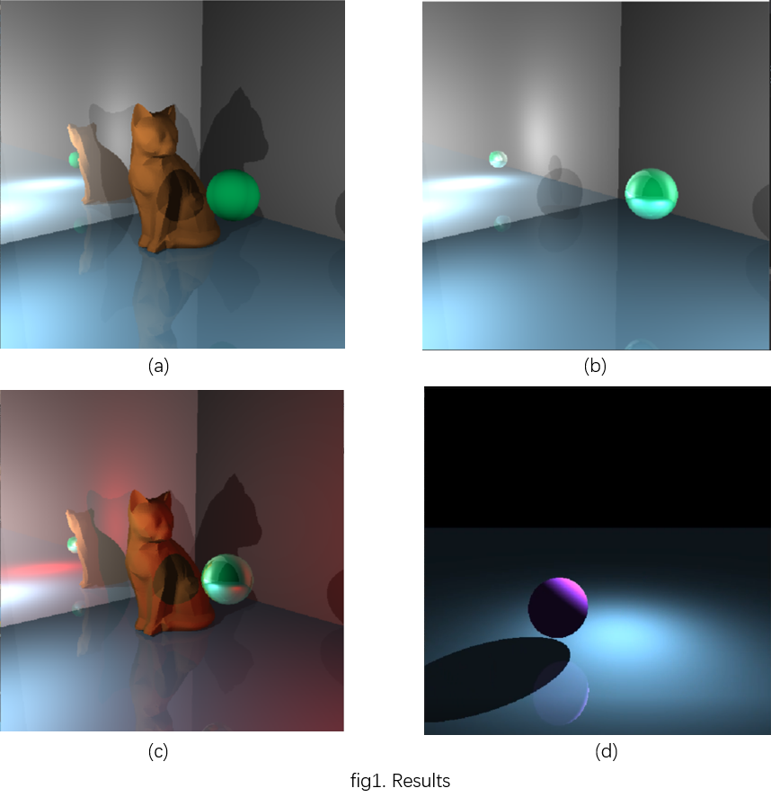

= Abstract
This is an implementation of ray tracing algorithm in CG using c++. The implementation details is shown in README.pdf.

This is an assignment of SJTU CG class. It is based on OpenGL while it only uses glut to render pixels in the window. The performance is shown below.

animation.mp4 is a short animation section rendered by this project. However, as there is no GPU computation and the algorithm is really simple, the time to render a frame can be very long (several minutes) if you load a complex 3D mesh model. But it can be much more fast while rendering basic graphical models.
